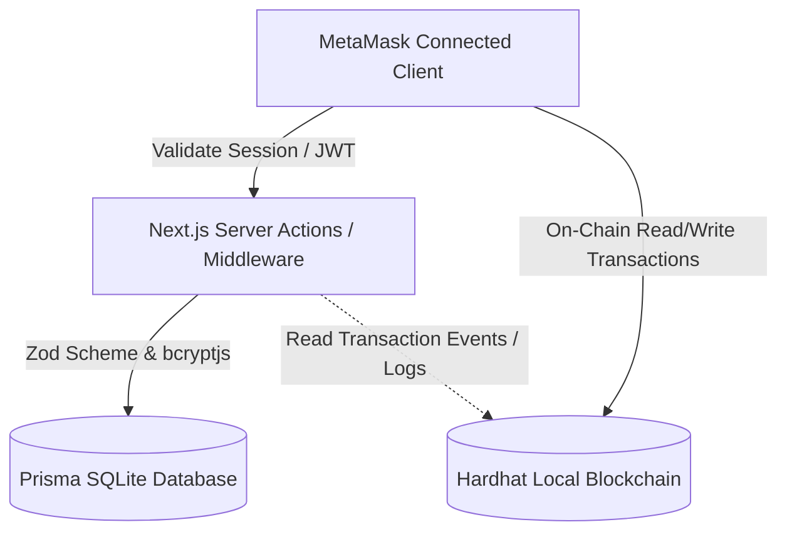

# SafeEscrow: Blockchain-Powered Freelance Escrow & Identity Ecosystem

SafeEscrow is a decentralized freelance agreement and secure escrow platform built to ensure transparent contract execution, cryptographic identity bindings, role guards, and real-time blockchain status tracking. 

By combining secure on-chain escrow operations via Ethereum smart contracts with robust local databases and JWT-based session security, SafeEscrow makes trustless freelance transactions completely seamless and bulletproof.

---

## 🔒 Security & Architectural Blueprint

The application implements a zero-trust model between the client, server database, and blockchain:



### 1. Cryptographic Password Security
We employ `bcryptjs` to securely hash user passwords off-chain before writing to the database:
- **Hashed Storage**: Passwords are never stored in plain-text. They are hashed using a robust cost-factor work parameter of `10` rounds.
- **Timing Attacks Protection**: Standard secure comparison guards protect login matching against timing-based enumeration vectors.

### 2. Edge-Safe JWT Sessions (jose)
Instead of plain client-side authentication states:
- **Secure Token**: Authentic logins issue a custom JSON Web Token (JWT) signed with a secure server-only environmental secret key.
- **HttpOnly Cookies**: The session token is transmitted and stored within an `HttpOnly`, `Secure` (in production), `SameSite=Strict` cookie. This makes the session completely immune to Cross-Site Scripting (XSS) token theft.
- **Edge Middleware**: Next.js Edge Middleware intercepts any request to `/buyer` or `/seller` on-the-fly, decrypting the JWT cookie and performing immediate role authorization checks.

### 3. Live Wallet Alignment Overlay (MetaMask Listeners)
To guarantee session integrity:
- **Wallet Binding**: A user's account registration binds their username permanently to a specific public Ethereum wallet address.
- **Live Mismatch Guards**: The client-side React Auth Context subscribes to active MetaMask events (`accountsChanged`, `chainChanged`). If a user switches accounts in MetaMask, the UI triggers a secure overlay block, prompting them to switch back or connect the correct wallet.

### 4. Blockchain as the Single Source of Truth
We separate caching concerns from our source of truth:
- **SQLite Role**: Acts as an ultra-fast indexing and UI cache for user profiles, off-chain project parameters (titles, descriptions, timestamps), and usernames.
- **Smart Contract Role**: Acts as the ultimate authority for financial, state, and settlement tracking. Live contract reads (`projects(projectId)`) override SQLite status cache fields in real-time. Undeployed or rejected projects are automatically excluded from lists and purged from search pools.

### 5. API Input Sanitization Layer (Zod)
All off-chain endpoints (`POST /api/auth/register`, `POST /api/auth/login`, `POST /api/projects`) filter incoming bodies against strict `zod` schemas:
- **Regex Format Enforcements**: Alphanumeric username restrictions, minimum password lengths, and standardized Ethereum address checksum formatting.

---

## 🏗️ Project Structure

```text
ocean-ledger/
├── contracts/
│   └── FreelanceEscrow.sol          # Escrow locks, Anti-stall timeouts, and Dispute code
├── scripts/
│   └── deploy.js                    # Automated compilation and deployment script
├── test/
│   └── FreelanceEscrow.js           # Smart contract suite verifying state transitions
├── prisma/
│   ├── schema.prisma                # Database model declarations (Users, Projects, txHash)
│   └── dev.db                       # Local SQLite Database
├── src/
│   ├── app/
│   │   ├── api/                     # APIs (auth/register, auth/login, users, projects)
│   │   ├── auth/                    # Tabbed Login / Register page with Web3 vinculation
│   │   ├── buyer/                   # Employer dashboard with searchable seller combobox
│   │   ├── seller/                  # Freelancer dashboard with deliverable submission form
│   │   ├── globals.css              # Custom styling definitions
│   │   ├── layout.tsx               # Root App layout and Providers initialization
│   │   └── page.tsx                 # Home landing page with dynamic profile greetings
│   ├── components/
│   │   ├── Logo.tsx                 # Branded SafeEscrow lock vector
│   │   ├── WalletConnect.tsx        # Injected Web3 connection buttons
│   │   ├── HistoryTable.tsx         # Reconciled tabular ledger querying Hardhat real-time
│   │   └── TransparencyPanel.tsx    # Live block and event tracking overlay
│   ├── hooks/
│   │   └── useAuth.tsx              # Auth Context managing sessions & MetaMask listeners
│   └── lib/
│       ├── jwt.ts                   # Token encryption and decryption helper
│       └── contractData.json        # Compiled ABI definitions and contract address
├── hardhat.config.ts                # Local Hardhat compilation and network config
├── package.json                     # Package dependencies (bcryptjs, jose, zod, wagmi)
└── README.md                        # Documentation
```

---

## 🚀 Local Runbook & Startup Guide

Follow this startup sequence to run and compile SafeEscrow locally:

### 1. Install Required Software
Make sure you have installed:
- **Node.js** (v18 or newer)
- **MetaMask** browser extension

### 2. Startup Sequence
Always run and initialize the components in the following order:

#### Step 1: Install Node Dependencies
```bash
npm install
```
*Installs Next.js, Hardhat, Prisma, bcryptjs, jose, zod, and web3 library dependencies.*

#### Step 2: Initialize SQLite Database Schema
```bash
npx prisma db push
```
*Generates the local SQLite database file (`prisma/dev.db`), compiles models, and provisions Prisma Client.*

#### Step 3: Launch Local Hardhat Blockchain
Open a **new, dedicated terminal** and spin up your local Ethereum emulator:
```bash
npx hardhat node
```
*This starts a local JSON-RPC server at `http://127.0.0.1:8545` and exports 20 pre-funded test accounts with their private keys. Keep this terminal running.*

#### Step 4: Deploy Escrow Smart Contract
Open a **separate terminal** and deploy your escrow logic:
```bash
npx hardhat run scripts/deploy.js --network localhost
```
*Compiles FreelanceEscrow.sol, deploys it to block #1, and generates ABI references in `src/lib/contractData.json`.*

#### Step 5: Start the Development Server
```bash
npm run dev
```
*Launches the Next.js Turbo server. Navigate to `http://localhost:3000` to access the platform.*

---

## 🦊 Web3 Wallet Setup

1. **MetaMask Local Network**:
   Add a custom network in MetaMask using these credentials:
   - Network Name: `Hardhat Localhost`
   - RPC URL: `http://127.0.0.1:8545`
   - Chain ID: `31337`
   - Currency Symbol: `ETH`

2. **Import Test Accounts**:
   From your active Hardhat node terminal, copy the private keys:
   - **Account #0** (Buyer role)
   - **Account #1** (Seller role)
   Import them into MetaMask via **Import Account** using their private keys.

---

## 💻 Verification & Tests

To execute the smart contract test suite validating state lock and anti-stall timings:
```bash
npx hardhat test
```