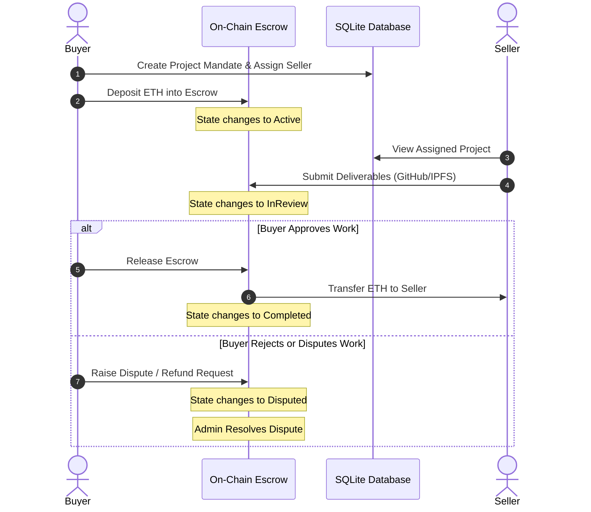

# Ocean Ledger: Blockchain-Powered Freelance Escrow & Mandate System

Ocean Ledger is a decentralized freelancing and escrow platform built to bring trust, transparent workflows, and dispute protection to Buyers and Sellers. Built using Ethereum smart contracts, Hardhat, Prisma, and Next.js 14, the platform ensures freelance agreements are governed by transparent, self-executing blockchain logic.

---

## 🌟 Key Features

### 🛡️ Smart Contract Escrow Lock
All financial agreements are managed directly on-chain by `FreelanceEscrow.sol`. Funds remain locked securely in escrow and are only released upon project completion or dispute resolution.

### 💼 Dual-Role Dashboards

#### Buyer Dashboard (`/buyer`)
- Create project mandates
- Assign sellers
- Deposit ETH into escrow
- Review and approve deliverables

#### Seller Dashboard (`/seller`)
- Connect MetaMask wallet
- View assigned projects
- Submit work proof (GitHub/IPFS links)

### ⛓️ Real-Time Blockchain Transparency
- Live Hardhat blockchain monitoring
- Real-time block confirmations
- Wallet-connected frontend using Wagmi & Viem

### 🗃️ Hybrid Architecture
#### On-Chain
- Escrow handling
- ETH transfers
- State transitions
- Dispute tracking

#### Off-Chain
- Project metadata storage
- Fast indexing using Prisma + SQLite
- Faster frontend rendering

---

# 🏗️ Project Structure

```text
ocean-ledger/
├── contracts/
│   └── FreelanceEscrow.sol

├── scripts/
│   └── deploy.js

├── test/
│   └── FreelanceEscrow.js

├── prisma/
│   ├── schema.prisma
│   └── dev.db

├── src/
│   ├── app/
│   │   ├── api/projects/
│   │   ├── buyer/
│   │   ├── seller/
│   │   ├── globals.css
│   │   ├── layout.tsx
│   │   └── page.tsx
│   │
│   ├── components/
│   │   ├── ui/
│   │   ├── Providers.tsx
│   │   ├── WalletConnect.tsx
│   │   └── TransparencyPanel.tsx
│   │
│   └── lib/
│       ├── utils.ts
│       └── contractData.json

├── hardhat.config.ts
├── tailwind.config.ts
├── tsconfig.json
└── package.json
```

---

# 🏁 How the Project Works



---

# 🚀 Setup & Execution Guide

## 1. Install Required Software

Install:

- Node.js (v18 or newer)
- MetaMask browser extension

---

## 2. Open the Project Folder

```bash
cd ocean-ledger
```

---

## 3. Install Dependencies

```bash
npm install
```

This installs:

- Next.js
- Hardhat
- Prisma
- Wagmi
- Tailwind CSS
- Solidity dependencies
- Other required packages

---

## 4. Setup Prisma SQLite Database

```bash
npx prisma db push
```

This:

- creates the SQLite database
- syncs Prisma schema
- generates Prisma client

---

## 5. Start Hardhat Blockchain

Open a NEW terminal and run:

```bash
npx hardhat node
```

You will see:

- Local blockchain running at:
  `http://127.0.0.1:8545`
- 20 test Ethereum accounts
- Their private keys

⚠️ Keep this terminal OPEN.

---

## 6. Deploy Smart Contract

Open another terminal and run:

```bash
npx hardhat run scripts/deploy.js --network localhost
```

This:

- compiles the Solidity contract
- deploys the escrow smart contract
- generates:
  `src/lib/contractData.json`

---

## 7. Configure MetaMask

Open MetaMask.

### Add Hardhat Local Network

| Field | Value |
|---|---|
| Network Name | Hardhat Localhost |
| RPC URL | http://127.0.0.1:8545 |
| Chain ID | 31337 |
| Currency Symbol | ETH |

Save the network.

---

## 8. Import Test Accounts

From the Hardhat terminal:

### Import:
- Account #0 → Buyer
- Account #1 → Seller

Use:
- MetaMask → Account → Import Account

Paste the private keys shown in the Hardhat terminal.

---

## 9. Start Frontend

Open another terminal:

```bash
npm run dev
```

Open:

```text
http://localhost:3000
```

---

# 💻 Using the Application

## Buyer Side
- Connect MetaMask wallet
- Create project mandate
- Deposit ETH into escrow
- Review seller submissions
- Approve or dispute work

## Seller Side
- Connect seller wallet
- View assigned projects
- Submit deliverables
- Receive escrow payment

---

# ⚖️ Escrow Workflow

- Buyer deposits ETH into escrow
- Seller submits deliverables
- Buyer approves:
  - ETH released automatically
- Buyer disputes:
  - Contract enters dispute state

---

# 🧪 Run Smart Contract Tests

```bash
npx hardhat test
```

---

# 📌 Recommended Terminal Setup

## Terminal 1
```bash
npx hardhat node
```

## Terminal 2
```bash
npx hardhat run scripts/deploy.js --network localhost
```

## Terminal 3
```bash
npm run dev
```

---

# 🔄 Full Startup Order

Always run in this order:

```text
1. npm install
2. npx prisma db push
3. npx hardhat node
4. npx hardhat run scripts/deploy.js --network localhost
5. npm run dev
```

---

# ❗ Common Errors & Fixes

## “Port 8545 already in use”
Close old Hardhat terminals/processes.

---

## “contractData.json missing”

Run deployment again:

```bash
npx hardhat run scripts/deploy.js --network localhost
```

---

## Prisma Errors

```bash
npx prisma generate
npx prisma db push
```

---

## MetaMask Wrong Network

Ensure:
- Chain ID = `31337`
- RPC URL = `http://127.0.0.1:8545`

---

# 🛠️ Technologies Used

- Next.js 14
- TypeScript
- Solidity
- Hardhat
- Prisma
- SQLite
- Tailwind CSS
- Wagmi
- Viem
- MetaMask
- Ethereum